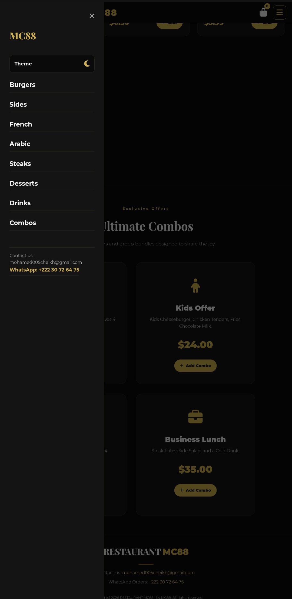
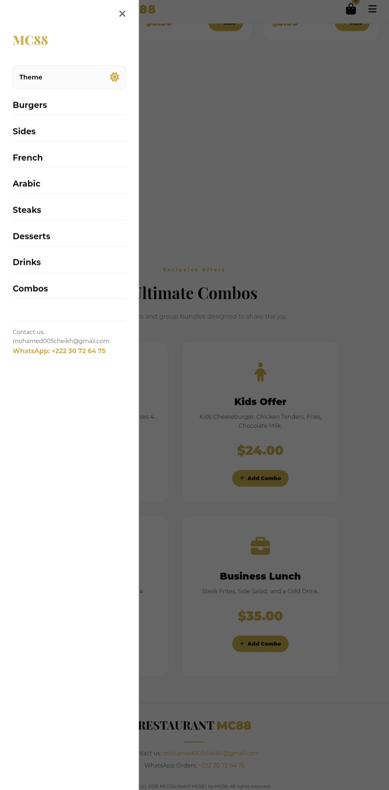
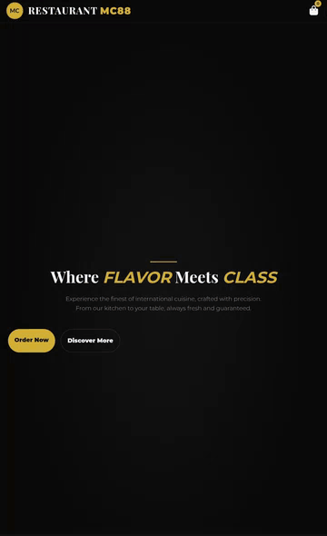
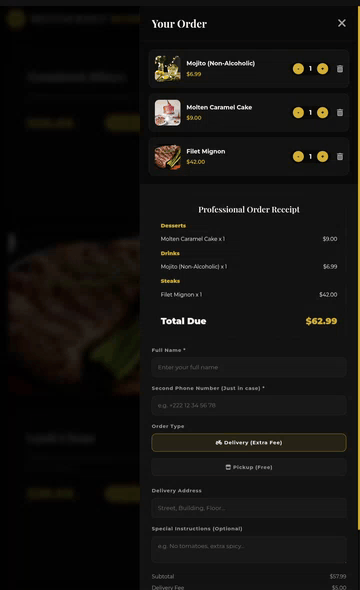

<div align="center">

# 🍽️ Restaurant MC88

**Where flavor meets class.**

<br />



</div>

---

## 👋 About

Restaurant MC88 is a small digital home for a kitchen that takes pride in what it serves.

You can browse the menu, pick what you like, and send your order straight to us on WhatsApp — no accounts, no waiting, no complications. Just good food and a clean experience, on your phone or on your computer.

It was made to feel like walking into the restaurant: warm, simple, and focused on the food.

---

## 🍔 What you'll find

**Eight sections, one kitchen.**  
Burgers, Sides, French dishes, Arabian nights, Steaks, Desserts, Drinks, and a small collection of Combos for when you can't decide.

**A cart that thinks with you.**  
Add anything you want, change the quantity, remove what you don't — everything updates right away, and the total is always in front of you.

**Order straight from your phone.**  
When you're ready, we build a clean receipt with your items grouped nicely, and send it to our WhatsApp. You'll see exactly what you're ordering before you press send.

**Delivery or pickup — your call.**  
Choose delivery and we'll ask for your address. Choose pickup and you skip the fee. Simple as that.

**A light and dark side.**  
Switch themes from the menu, and the site remembers what you picked for next time.

---

## 📸 A look inside

<div align="center">
  
</div>

<br />

<div align="center">
  
</div>

<br />

<div align="center">
  
</div>

---

## 🧭 How ordering works

It's really this simple:

1. **Scroll through the menu** and tap "Add" on anything that looks good.
2. **Open your order** from the bag icon at the top — you can adjust quantities or remove items there.
3. **Fill in your details** — your name, a backup phone number, and where you'd like it delivered (or pick it up yourself).
4. **Send it to us on WhatsApp** — we'll receive a tidy receipt with everything spelled out and get back to you to confirm.

That's it. No sign-up, no payment screens, no noise.

---

## ⚙️ If you're running this yourself

A few small things you'll probably want to change:

**Your WhatsApp number** — look for this line and put your own number in (international format, no `+` or spaces):

```javascript
const WHATSAPP_NUMBER = '22230726475';
