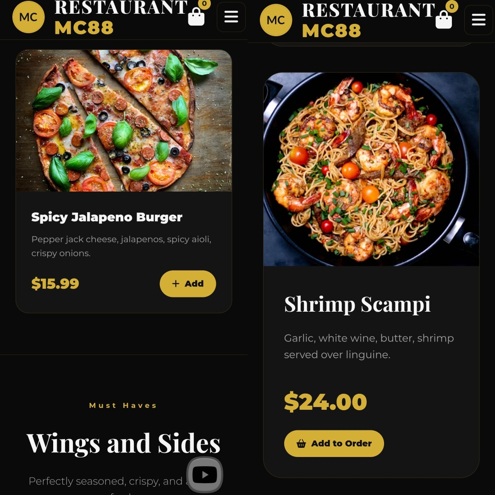
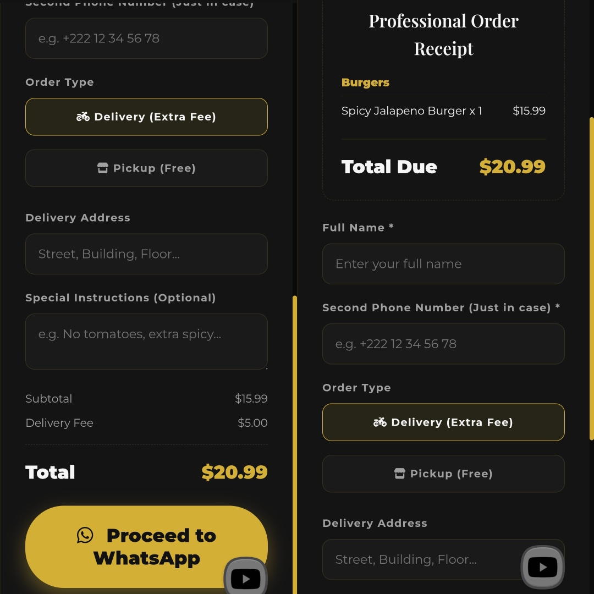

# 🍽️ Restaurant MC88

**Where flavor meets class.**

 

---

## 👋 Welcome

Restaurant MC88 is a small digital home for a kitchen that takes pride in what it serves.

Here you can browse the full menu, pick what you like, and send your order straight to us on WhatsApp — no accounts, no waiting, no complications. Just good food and a clean experience, whether you're on your phone or at your computer.

Everything here is made to feel like walking into the restaurant: warm, simple, and focused on the food.

---

## 🍔 What you'll find

**Eight sections, one kitchen.**  
Burgers, Sides, French dishes, Arabian nights, Steaks, Desserts, Drinks, and a small collection of Combos for when you can't decide.

**A cart that thinks with you.**  
Add anything you want, change the quantity, remove what you don't — everything updates right away, and the total is always in front of you.

**Order straight from your phone.**  
When you're ready, we build a clean receipt with your items grouped by section, and send it to our WhatsApp. You see exactly what you're ordering before you press send.

**Delivery or pickup — your call.**  
Choose delivery and we'll ask for your address. Choose pickup and you skip the fee.

**A light and dark side.**  
Switch themes from the menu, and the site remembers what you picked for next time.

---

## 📸 A look inside
 

  

 

  

 

  

 

---

## 🧭 How ordering works

It's really this simple:

1. **Scroll through the menu** and tap "Add" on anything that looks good.
2. **Open your order** from the bag icon at the top — you can adjust quantities or remove items there.
3. **Fill in your details** — your name, a backup phone number, and where you'd like it delivered (or pick it up yourself).
4. **Send it to us on WhatsApp** — we receive a tidy receipt with everything spelled out, and we get back to you to confirm.

That's it. No sign-up, no payment screens, no noise.

---

### 📞 Get in touch

 

© 2026 Mohamed Cheikh — Restaurant MC88

